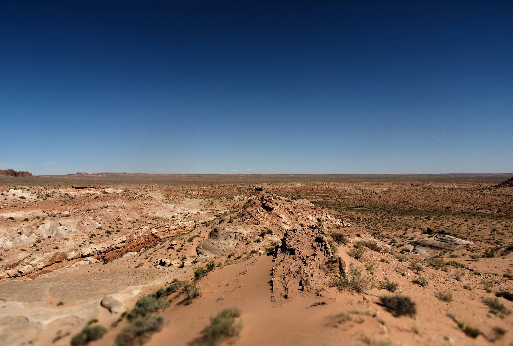

{:class="img-responsive"}

## Research

### Earthquake Statistics

What causes some earthquakes to have more aftershocks than others? In <a href="https://scholar.google.ca/citations?hl=en&user=XsIHgIsAAAAJ">__this study__</a>, we systematically tested how attributes of a mainshock related to its setting (depth, plate boundary type, etc.) and its sources (stress drop, radiated energy, source dimensions, etc.) influence the number of aftershocks to come. We work towards a complimentary approach to aftershock forecasting that relies solely on attributes of the source instead of long term calibration.

### Fault Zone Geomorphology

Faults are iconic features of the landscape. Can we use their expression in the landscape to better understand them? I am using a combination of field observations, remote measurements and landscape evolution models to better characterize fault structure with a particular focus on fault zone damage.

### Fault Mechanics

Do faults smooth with cummulative displacement? In <a href="https://agupubs.onlinelibrary.wiley.com/doi/abs/10.1029/2018JB015638">__this study__</a>, we leveraged a natural laboratory to characterize the topography of over one hundred individual slip surfaces. Our study provides clear evidence for smoothing of fault slip surfaces with cummulative offset.

## Other Interests

-----
thing | 2 | more
----------
stuff | another | row
