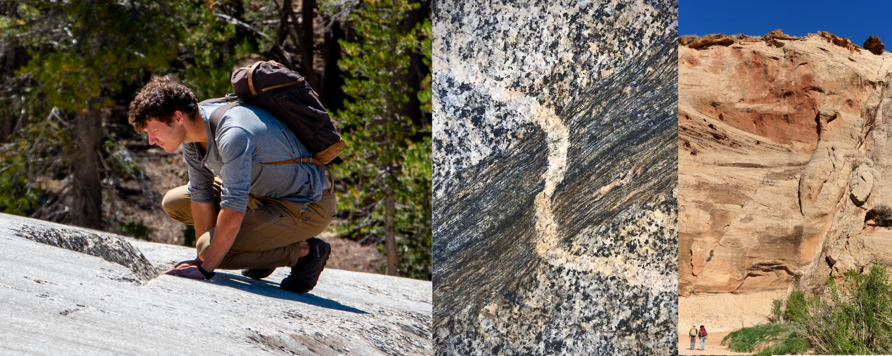

<head>
  <link rel="stylesheet" href="https://fonts.googleapis.com/icon?family=Material+Icons">
  <meta name="google-site-verification" content="wFTtTHmL739-XZIkQX0sAv-Ihaoesq8J7GxJI0vbCRc" />
  
</head>

## About me

I am a Phd candidate at the University of California Santa Cruz working with Emily Brodsky, Thorne Lay and Noah Finnegan. I study various problems under the umbrella of earthquake physics, hypothesis testing and forecasting.

## Research

### Earthquake Statistics

{:class="img-responsive"}

What causes some earthquakes to have more aftershocks than others? In <a href="https://scholar.google.ca/citations?hl=en&user=XsIHgIsAAAAJ">__this study__</a>, we systematically tested how attributes of a mainshock related to its setting (depth, plate boundary type, etc.) and its sources (stress drop, radiated energy, source dimensions, etc.) influence the number of aftershocks to come. We work towards a complimentary approach to aftershock forecasting that relies solely on attributes of the source instead of long term calibration. This project was funded by the NESRC Alexander Graham Bell fellowship.

### Fault Zone Geomorphology

<video
       loop="loop"
       autoplay="autoplay"
       width="320"
       height="240"
       name="Video Name"
       src="assets/gifs/landscape_evolution.mov">
</video>

Faults are iconic features of the landscape. Can we use their expression in the landscape to better understand them? I am using a combination of field observations, remote measurements and landscape evolution models to better characterize fault structure with a particular focus on fault zone damage. This project is funded by NASA's FINNEST fellowship.

### Fault Mechanics

{:class="img-responsive"}

Do faults smooth with cummulative displacement? In <a href="https://agupubs.onlinelibrary.wiley.com/doi/abs/10.1029/2018JB015638">__this study__</a>, we leveraged faults in the San Rafael Desert as a natural laboratory to test this question. We measured the roughness of over a hundred slip surfaces using high resolution laser scanners. Our study provides clear evidence for smoothing of fault slip surfaces with cummulative offset.

<a class="twitter-timeline" data-height="300" width="500" href="https://twitter.com/keliankaz?ref_src=twsrc%5Etfw">Tweets by keliankaz</a> 

<!-- -----
thing | 2 | more -->
